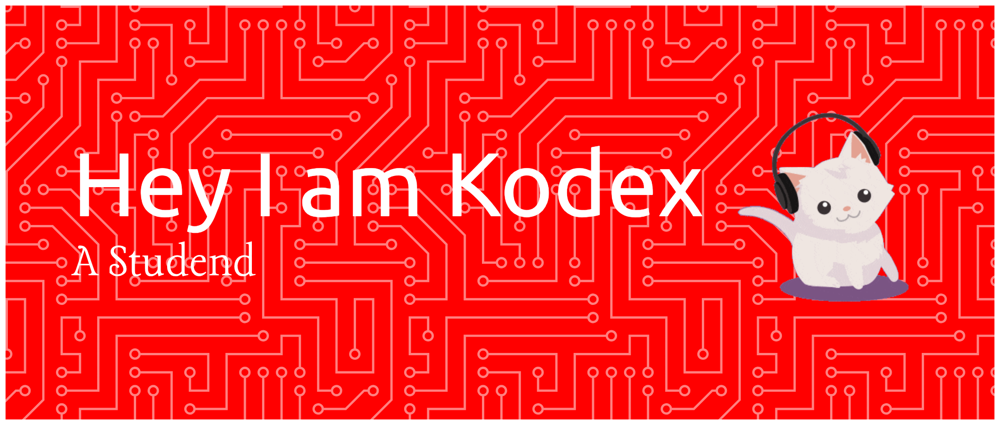

## 💫 About Me:
I am a student who enjoys learning new things.

### 🌐 Socials:
  

## 💻 Tech Stack:
          
## 📊 GitHub Stats:
 
 

### 🏆 GitHub Trophies

#### 🔝 Top Contributed Repo

---

<!-- Proudly created with GPRM ( https://gprm.itsvg.in ) -->
<picture>
  <source media="(prefers-color-scheme: dark)" srcset="https://raw.githubusercontent.com/01Kodex/01Kodex/output/pacman-contribution-graph-dark.svg">
  <source media="(prefers-color-scheme: light)" srcset="https://raw.githubusercontent.com/01Kodex/01Kodex/output/pacman-contribution-graph.svg">
  
</picture>

###
